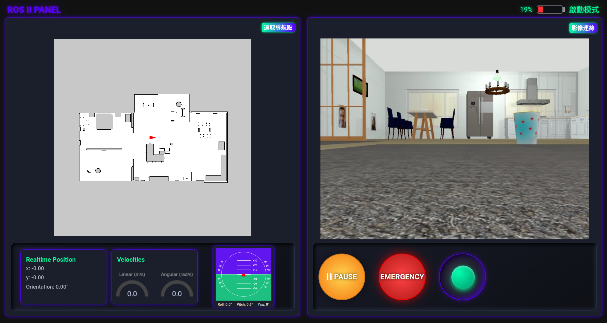

# Web Monitoring UI – VisionBot Dashboard

## 專案定位與說明

Web Monitoring UI 是 VisionBot 系統的 **Web 端監控與操作介面 (Dashboard / Control Panel)**。

此專案的目標 :

- 提供 **遠端監控** (影像 / 狀態)
- 提供 **機器人操作與導航指令下發**
- 作為使用者與機器人系統之間的 **唯一入口**

> Web Monitoring UI **不直接連線 ROS**，所有控制與資料皆透過中介服務完成。

### Main Dashboard

<!--  -->
<p align="center">
  
</p>

## 系統環境（System Requirements）

- **OS**：Ubuntu 22.04 LTS
- **Node.js**：v20.x（建議使用 LTS）
- **npm**：隨 Node.js 安裝
<!-- - **Browser**：
  - Chrome / Firefox / Edge / Safari
- **IOS**：
  - Iphone / Ipad

>若使用 AWS KVS WebRTC 影像串流
不支援 Edge / Safari 與 IOS 系統 -->

---

## 技術架構

#### Frontend

- React
- HTML / CSS / JavaScript / Bootstrap

#### Communication (通訊方式)

- REST API（Robot Server）
- WebSocket / MQTT

#### Video Streaming (Client Side)

- RTSP / HLS
- WebRTC (AWS KVS)

---

## 系統角色與責任

### Web Monitoring UI 負責

- 顯示機器人即時狀態 (Position / Linear & Angular velocity / Map / IMU)
- 顯示影像 (HLS / WebRTC)
- 提供操作介面 :
  - 導航目標設定
  - 系統模式切換
  - 手動控制
  - Safety Stop
  - 取消導航
- 透過 API / MQTT 與後端系統通訊

### Web Monitoring UI 不負責

- ❌ ROS 系統控制 (由 Robot Server 負責)
- ❌ ROS Topic 直接存取
- ❌ SLAM / Navigation 邏輯
- ❌ 影像串流伺服器 (僅作為播放端)

---

### 安裝 Node.js

```sh
curl -fsSL https://deb.nodesource.com/setup_20.x | sudo -E bash -
sudo apt install -y nodejs
```

## 執行 Usage

  1- 建立專案目錄

  ```sh
  mkdir -p ~/web_panel
  ```

  2- Clone 專案

  ```sh
  cd ~/web_panel
  git clone https://github.com/jaminpengstudio-wq/Ros2-Web-Panel.git .
  ```

  3- 安裝依賴套件

  ```sh
  npm install
  ```

  4- 啟動 Web Panel

  ```sh
  npm run start
  ```
